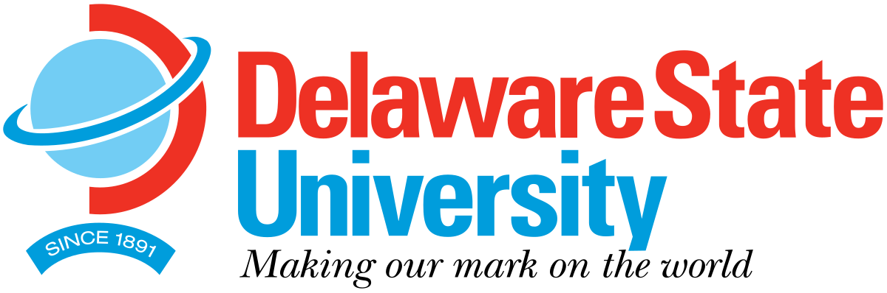
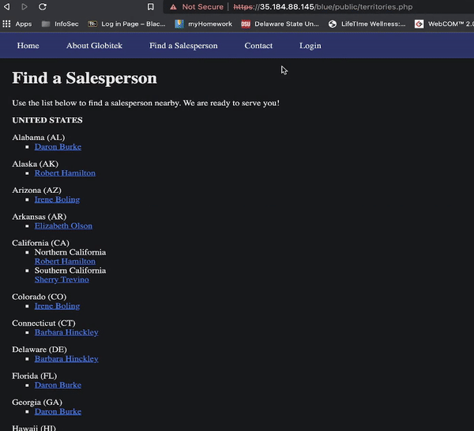
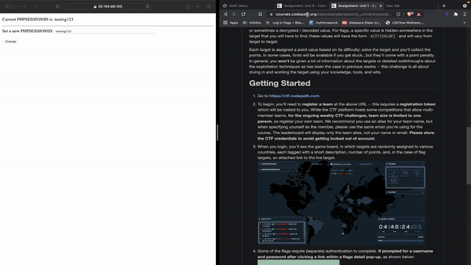
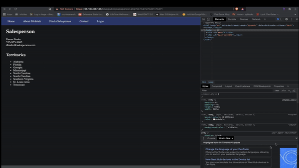
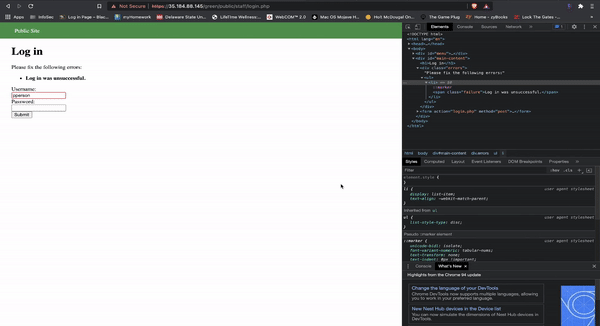
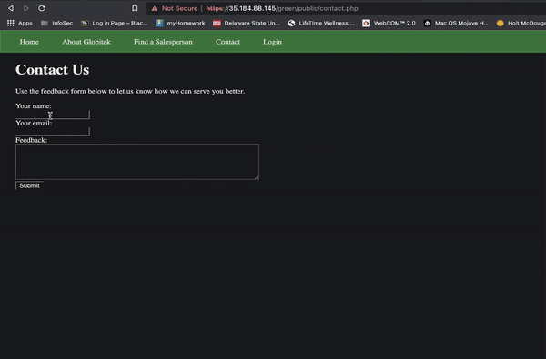

# codepath_homework

<h2>Assignment 9 - Pentesting Live Targets</h2>

For this assignment, we were asked to "hack" into a live webservice using some of the methods that we've learned so far. In particular, it asked for us to perform the following hacks

<ul>
	<li>CSRF (Cross-Site Request Forgery)</li>
	<li>IDOR (Indirect Object Reference)</li>
	<li>Session Hijacking/Fixation</li>
	<li>SQLi (SQL Injection)</li>
	<li>Username Enumeration</li>
	<li>XSS (Cross-Site Scripting)</li>
</ul>

#
<h2>Exploit in _: CSRF</h2>

#
<h2>Exploit in Red: IDOR</h2>
On the public site under the section "Finding a salesperson", when you click on a sales person it gives the sales person info back, however the url has a queryStringParameter that denotes the id of a salesperson. Specifically, there is one that's missing from the list and it's id #10. When putting it into the other 2 sites, it just takes us back to the sales person page however on the Red, it loads a page that isn't public.

#
<h2>Exploit in Blue: Session Hijacking/Fixation</h2>
When you try to take a logged in session id from the red/green sites and apply it to the attackers session, it still makes the attacker sign in. When you do it on the blue site, it let's the attacker sign in and access all admin features without the use of any user credentials.

#
<h2>Exploit in Blue: SQLi</h2>
On the public site under a sales person, if you input a single quote, you get a database query error. On the other sites, it sanatizes the single quote.

#
<h2>Exploit in Green: Username Enumeration</h2>
Depending on the username inputted. If you inspect the element where it tells you "Login was unsuccessful", the class of the span element will tell you if it "failed" or if it was a "failure". When putting in a valid username, it says "failure" so we can denote that failure means the username exists

This is not good as someone could use that information to get a valid admin username then use something like SQLi to login as an admin.

#
<h2>Exploit in Green: XSS</h2>
XSS occurs in the feedback section on the public site. When you go to submit the feedback, you can insert a javascript with the proper tags. On the admin side, when you go to look at the feedback, the script will execute. 

This is not good as someone can get login credentials or some sort of key information.

#
<h2>Concept Review</h2>
For myself, some of the easier tasks were the IDOR and the XSS as they were relatively easier to find. This was because of a user having the last name "Not Public until Sept. 1" and the feedback being the only place to input any information

To Avoid Username Enumeration in the future, the developer should not seperate between a sucessful username on the client end, meaning I should not be able to notice any difference between a faild logon.

AND can be used, but is soley dependent on if the first condition is true. In most cases, it's comparing it to some sort of value and if the value doesn't pass finding that information, it will fail.

I can't think of a code that needs to be removed for IDOR to reveal something.

An attacker would more than likely include a time to activate within there XSS, but also have some sort of function that writes the sensative data to their local hardware. You also don't want the script to autorun and you want the code to remain "hidden".

I would get an admin to visit a CSRF page by making it autoload the page if the XSS worked. Otherwise, I would try and hide the link by making some sort of advertisement that I'm someone who is working in the field of what the company needs and would like to be in touch. Attached is my resume with a disguised link.

Session Hijacking would be easier compared to fixation because for the latter, you need someone whom has admin access to the application/website you're trying to design. Because of this, fixation is way easier to defend from rather than hijacking.